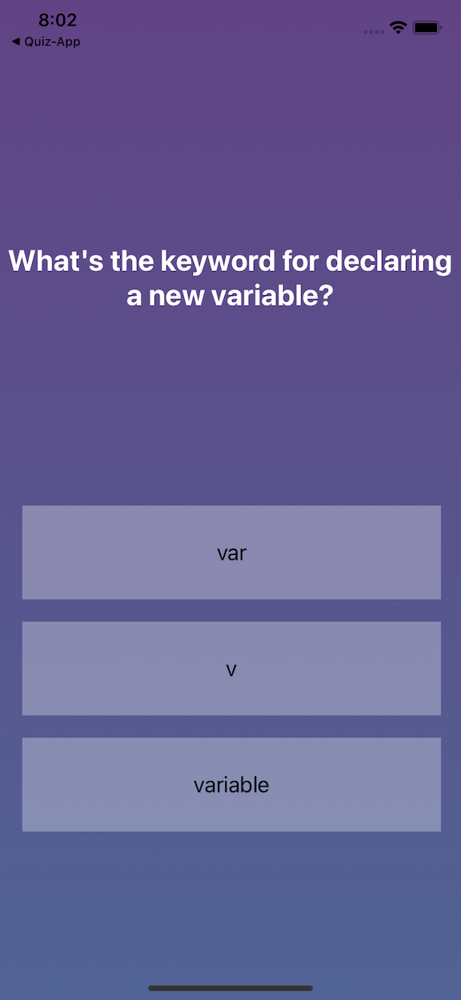
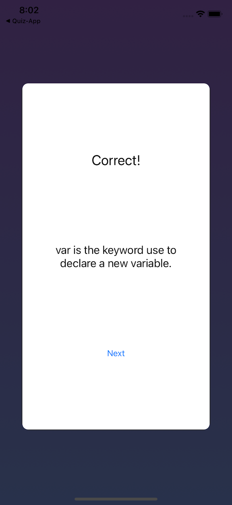
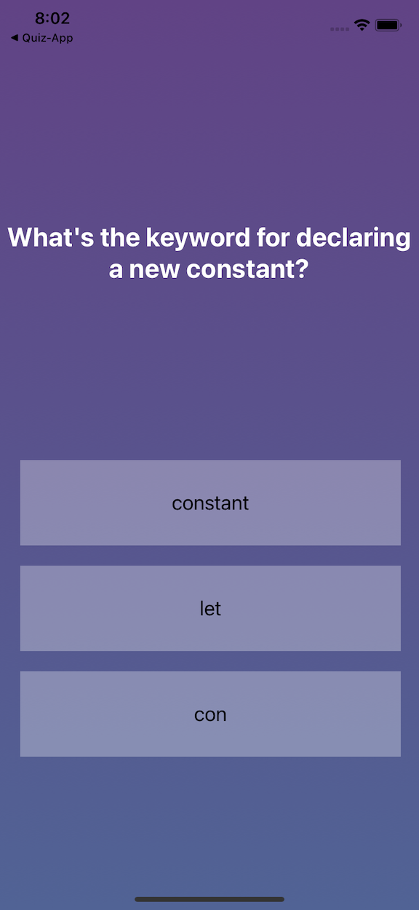
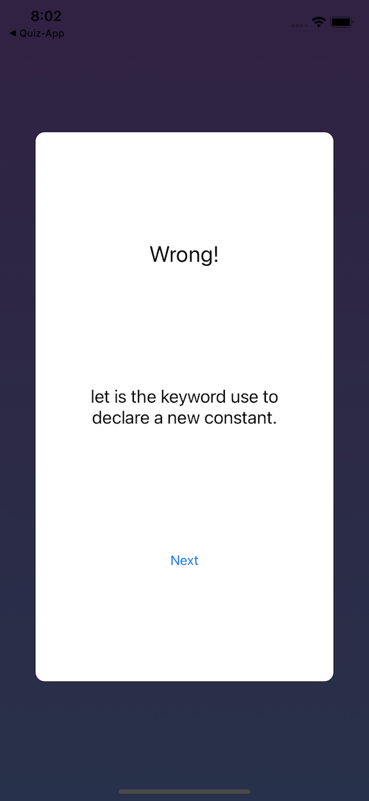
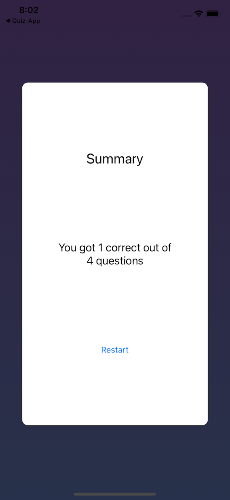

#  Quiz App

## User answers coding questions retrieved from remote json

### First question displays

### Pop up dialog box displays either correct or wrong answer, user dismisses the dialog

### Next question is displayed

### Pop up dialog displays either correct or wrong answer, user dismisses the dialog

### Summary dialog appears at end of quiz, displaying users total correct answers

